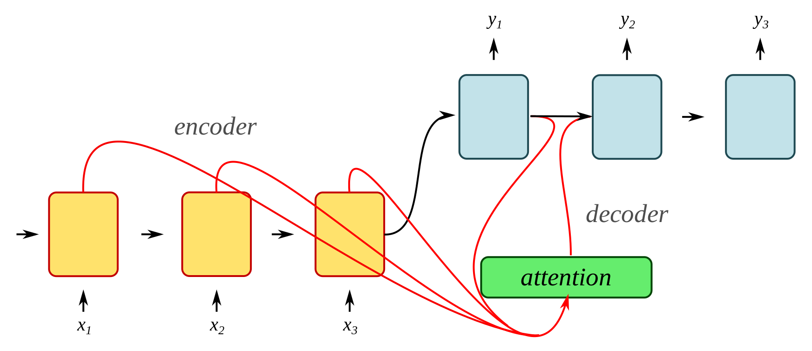

# *Neural Machine Translation* implemented in PyTorch



This is a PyTorch implementation of *[Effective Approaches to Attention-based Neural Machine Translation](https://arxiv.org/pdf/1508.04025.pdf)* using *[scheduled sampling](https://arxiv.org/pdf/1506.03099.pdf)* to improve the parameter estimation process.
It uses tab-delimited bilingual sentence pairs acquired from [here](http://www.manythings.org/anki/) to train predictive language models.

#### Implementation Architecture

The model is trained end-to-end using *[stacked RNNs](https://cs224d.stanford.edu/reports/Lambert.pdf)* for sequence encoding and decoding.
The decoder is additionally conditioned on a context vector for predicting the next constituent token in the sequence. This vector is computed using an *[attention mechnism](https://www.quora.com/What-is-Attention-Mechanism-in-Neural-Networks)* at each time step. Intuitively, the decoder is attempting to leverage information conglomerated by the encoder by deciding the relevancy of each encoding at each time step of the decoding process.

## Results

<table style="width:100%;text-align:left"> 
    <th>Input Sequence (English)</th>
    <th>Output Sequence (Spanish)</th>
    <tr style="font-style:italic">
        <td>how are you doing</td>
        <td>estas haciendo</td>
    </tr>
    <tr style="font-style:italic">
        <td>i am going to the store</td>
        <td>voy a la tienda</td>
    </tr>
        <td>she is a scientist</td>
        <td>ella es cientifico </td>
    <tr style="font-style:italic">
        <td>he is an engineer</td>
        <td>el es un ingeniero</td>
    </tr>
    <tr style="font-style:italic">
        <td>i am going out to the city</td>
        <td>voy al la de la ciudad</td>
    </tr>
    <tr style="font-style:italic">
        <td>i am running out of ideas</td>
        <td>me estoy quedando sin ideas</td>
    </tr>
</table>

## Prerequisites

* [Python 3.5](https://www.python.org/downloads/release/python-350/)
* [PyTorch](http://pytorch.org/)
* [NumPy](http://www.numpy.org/)

## Usage

To train a new language model invoke *train.py* with the desired language abbreviation you would like to translate english to. For instance, spanish can be translated to by specifying 'spa' as input. 'spa-eng.txt' in the data directory will be used. Other languages can be acquired from [here](http://www.manythings.org/anki/).

```
python train.py 'langname'
```

To translate an input sequence in english into another language, invoke *eval.py* and specify the desired language and sentence. The program will exit if the language model parameters are not found in the data directory or if the language prefix is mistyped.

```
python eval.py 'langname' 'some english words'
```

## Files

* [attention.py](attention.py)

    Attention nn module that is responsible for computing the alignment scores.

* [attention_decoder.py](attention_decoder.py)

    Recurrent neural network that makes use of gated recurrent units to translate encoded inputs using attention.

* [encoder.py](encoder.py)

    Recurrent neural network that encodes a given input sequence.

* [etl.py](etl.py)

    Helper functions for data extraction, transformation, and loading.

* [eval.py](eval.py)

    Script for evaluating the sequence-to-sequence model.

* [helpers.py](helpers.py)

    General helper functions.

* [language.py](language.py)

    Class that keeps record of some corpus. Attributes such as vocabulary counts and tokens are stored within instances of this class.

* [train.py](train.py)

    Script for training a new sequence-to-sequence model.